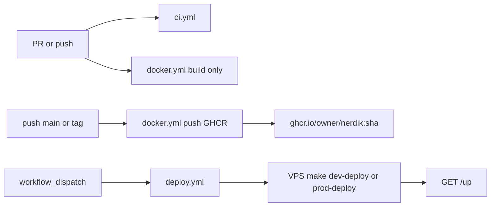

# CI/CD

Automated testing, image publishing, and (when a VPS is ready) remote deploy. For server setup and compose layout, see [deployment.md](deployment.md). For the full roadmap, see [deployment-plan.md](deployment-plan.md).

## Pipeline overview



| Workflow | File | When it runs |
|----------|------|----------------|
| CI | [`.github/workflows/ci.yml`](../.github/workflows/ci.yml) | Every PR and push to `main` |
| Docker | [`.github/workflows/docker.yml`](../.github/workflows/docker.yml) | PR (build only); `main` and `v*` tags (build + push) |
| Deploy | [`.github/workflows/deploy.yml`](../.github/workflows/deploy.yml) | Manual only (`workflow_dispatch`) |

## Without a git remote yet

Workflows in [`.github/workflows/`](../.github/workflows/) run only after the project is pushed to **GitHub**. Until then:

- Run tests locally: `vendor/bin/sail artisan test --compact` (with Sail up).
- Build and push images manually: `GITHUB_OWNER=… ./scripts/docker-publish.sh` (requires `docker login ghcr.io`).

After you create the remote, push `main` once to enable automated CI and GHCR publishes.

## CI (no VPS required)

**Job `test` (required to pass):**

- Builds and runs the same PostgreSQL image as production ([`docker/pgsql`](../docker/pgsql)) so Polish full-text search and migrations match prod.
- PHP 8.5, `composer install`, `npm ci && npm run build`, `php artisan migrate --force`, full test suite.
- `composer audit` for known dependency vulnerabilities.

**Job `pint` (informational):**

- `vendor/bin/pint --test` with `continue-on-error: true` — visible on the run but does not block merges.

### Branch protection (recommended)

In GitHub → Settings → Branches, require the **Test** job from the CI workflow before merging to `main`.

## Docker images (no VPS required)

On push to `main`, the Docker workflow publishes:

```text
ghcr.io/<github-owner>/nerdik:<full-git-sha>
```

On push of a semver tag `v*` (e.g. `v1.2.3`), the same image is also tagged with that version.

Pull requests only **build** the image (no push) to verify [`docker/production/Dockerfile`](../docker/production/Dockerfile).

### GHCR setup

1. Push to `main` once; the workflow uses `GITHUB_TOKEN` with `packages: write`.
2. GitHub → **Packages** → open `nerdik` → set visibility (private recommended until you decide on a public repo).
3. On each VPS, log in once: `docker login ghcr.io` (PAT with `read:packages` or deploy token).

### Publish locally (same tags as CI)

```bash
docker login ghcr.io
GITHUB_OWNER=your-github-owner ./scripts/docker-publish.sh
```

Or with an explicit SHA:

```bash
GITHUB_OWNER=your-github-owner GIT_SHA=$(git rev-parse HEAD) ./scripts/docker-publish.sh
```

`GITHUB_OWNER` can also live in `.env` on the machine that publishes.

## Deploy (VPS required)

Deploy is **manual** via Actions → **Deploy** → Run workflow. Choose `dev` or `prod` and an `image_tag` (git SHA from GHCR, or a semver tag).

If deploy secrets are not configured, the workflow prints a skip message and exits successfully so the repo stays green before you have a server.

**Setup guide:** [github-deploy-setup.md](github-deploy-setup.md) — SSH keys, GitHub secrets, environments, and verification.

Composer and npm dependencies are installed during the Docker image build (CI), not at deploy time. Deploy pulls the pre-built `ghcr.io/<owner>/nerdik:<sha>` image.

### Repository secrets

| Secret | Purpose |
|--------|---------|
| `DEPLOY_SSH_KEY` | Private SSH key for the deploy user |
| `DEPLOY_HOST_DEV` | Staging hostname or IP |
| `DEPLOY_HOST_PROD` | Production hostname or IP |
| `DEPLOY_USER` | SSH user (e.g. `deploy`) |

### Repository variables (optional, for smoke checks)

| Variable | Purpose |
|----------|---------|
| `DEV_APP_URL` | Base URL for staging, e.g. `https://staging.example.com` |
| `PROD_APP_URL` | Base URL for production |

### GitHub environments

- **`dev`** — used by dev deploy job (no approval required by default).
- **`production`** — used by prod deploy; add **required reviewers** under Settings → Environments for a manual approval gate.

### Server prerequisites

Before the first automated deploy:

1. VPS with Docker and Compose (see [deployment.md](deployment.md)).
2. Clone this repo (e.g. `/opt/nerdik`).
3. `.env` from [`.env.production.example`](../.env.production.example) or [`.env.staging.example`](../.env.staging.example) with `GITHUB_OWNER` set.
4. `docker/caddy/Caddyfile` from `docker/caddy/Caddyfile.example`.
5. `docker login ghcr.io` on the server.

Production deploy from the VPS:

```bash
cd /opt/nerdik
make vps-deploy
```

Production deploy from GitHub Actions (explicit SHA, no git pull):

```bash
IMAGE_TAG=<sha> ./scripts/vps-deploy.sh --no-pull
```

Dev deploy still uses `git pull` + `make dev-deploy`. Both paths end in [`scripts/deploy.sh`](../scripts/deploy.sh): pull image, `up -d`, `migrate --force`, config/route/view cache, restart worker/scheduler/reverb.

### Promote a tested SHA

```bash
# After CI published ghcr.io/owner/nerdik:abc123...
IMAGE_TAG=abc123 make dev-deploy    # on staging VPS or via Deploy workflow
IMAGE_TAG=abc123 make prod-deploy   # on production after approval
```

## Related commands

| Command | Use |
|---------|-----|
| `make vps-deploy` | Production VPS: git pull + deploy latest SHA |
| `make dev-deploy` | Staging VPS deploy |
| `make prod-deploy` | Production VPS deploy |
| `make docker-publish` | Build and push image from local machine |
| `IMAGE_TAG=<sha> make prod-deploy` | Pin deploy to a GHCR tag |
