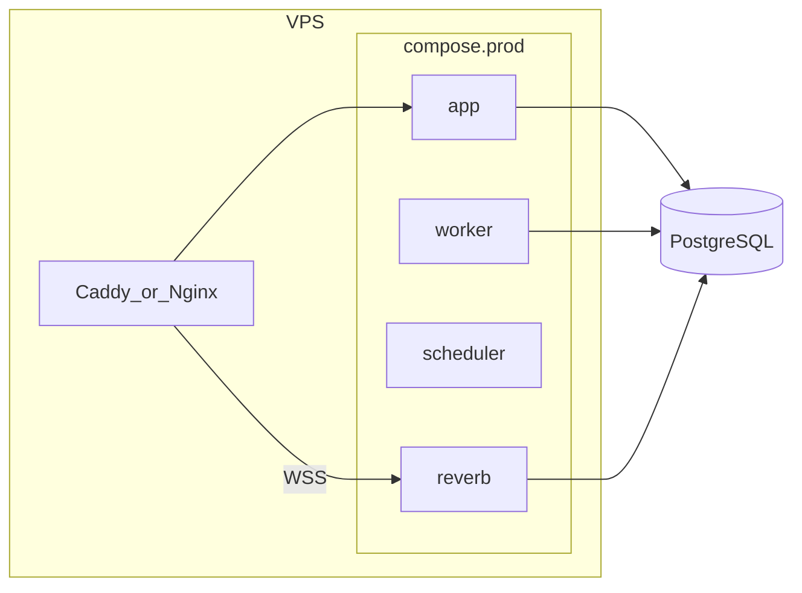

# Deployment plan

Roadmap from first production deploy through CI/CD and optional Kubernetes. For step-by-step commands on a live server, use [deployment.md](deployment.md). For local setup, see [development-workflow.md](development-workflow.md).

**Legend:** `[x]` done in repo · `[ ]` not started

---

## Executive summary

| Phase | Focus | Status |
|-------|--------|--------|
| 0 | Code and config readiness | **Done** |
| 1 | Production Docker on VPS | **Done** (repo) |
| 2 | Dev/prod environments, shared images | Not started |
| 3 | CI/CD | Not started |
| 4 | Kubernetes (optional learning path) | Not started |
| 5 | Public repository decision | Not started |
| 6 | Ongoing operations | Partially documented |

---

## Phase 0: Code and config readiness

**Goal:** Harden the application in git before building production infrastructure.

### Code and config

- [x] Production env template: [`.env.production.example`](../.env.production.example)
- [x] Local [`.env.example`](../.env.example) points to production template (comments only)
- [x] Trust reverse proxy: `TRUSTED_PROXIES` in [`bootstrap/app.php`](../bootstrap/app.php)
- [x] Force HTTPS URLs in production when `APP_URL` is `https://` ([`AppServiceProvider`](../app/Providers/AppServiceProvider.php))
- [x] Broadcast policy documented: any **logged-in** user may subscribe to `activity.{id}` when the activity exists ([`routes/channels.php`](../routes/channels.php)) — live counters before join
- [x] Tests for broadcast channel auth ([`tests/Feature/Broadcast/ActivityParticipationChannelTest.php`](../tests/Feature/Broadcast/ActivityParticipationChannelTest.php))
- [x] `telescope:prune` scheduled only when Telescope is enabled ([`routes/console.php`](../routes/console.php))
- [x] `viewPulse` gate for admins ([`AppServiceProvider`](../app/Providers/AppServiceProvider.php))
- [x] Deploy checklist: [deployment.md](deployment.md)
- [x] Full test suite and static analysis validated (manual, pre-Phase-0)

### Already in good shape (no Phase 0 change required)

- Health endpoint `/up` ([`bootstrap/app.php`](../bootstrap/app.php))
- Security headers middleware, rate limits, strong password defaults
- Telescope registered only in `local`
- Filament admin protected (`AdminOnly`, `is_admin`)
- Large automated test suite

### Manual before first prod deploy

- [ ] Copy `.env.production.example` → server `.env` and fill secrets
- [ ] Run post-deploy steps in [deployment.md](deployment.md)

---

## Phase 1: Production Docker (VPS-friendly)

**Goal:** Run Nerdik on a VPS using Docker, without treating Sail dev compose as production.

**Current state:** [`compose.yaml`](../compose.yaml) is Laravel Sail for local dev (bind mounts, `artisan serve`, Adminer, Mailpit). **Do not ship it unchanged to production.**

### Tasks

- [x] Multi-stage **production Dockerfile** ([`docker/production/Dockerfile`](../docker/production/Dockerfile): composer `--no-dev`, `npm ci && npm run build`, Nginx + PHP-FPM in `app`, Caddy at edge)
- [x] **`compose.prod.yaml`** with:
  - [x] `app` (web)
  - [x] `worker` (`queue:work`)
  - [x] `scheduler` (`schedule:work`)
  - [x] `reverb`
  - [x] PostgreSQL (containerized; external managed DB documented in [deployment.md](deployment.md))
  - [x] **No** Adminer / Mailpit / Vite dev port
- [x] Persistent volumes for `storage` (and DB if containerized)
- [x] Reverse proxy (Caddy in compose) for TLS and WebSocket proxy to Reverb ([`docker/caddy/Caddyfile.example`](../docker/caddy/Caddyfile.example))
- [x] Optional: managed PostgreSQL instead of container PG (documented)

---

## Phase 2: Dev and prod environments (shared images)

**Goal:** Same Docker image for dev and prod; differ only by env and compose overlay.

### Tasks

- [x] Container registry (GHCR-ready): `ghcr.io/${GITHUB_OWNER}/nerdik:<git-sha>` immutable tags
- [x] `compose.dev.yaml` / `compose.prod.yaml` overlays on shared `compose.stack.yaml` image
- [x] Promote by deploying a SHA (`IMAGE_TAG=<git-sha> make dev-deploy|prod-deploy`)
- [x] Keep one production-grade multi-stage Dockerfile; only build args differ per environment

| Share | Do not share |
|-------|----------------|
| Image per commit | `.env` secrets |
| Compose structure | Database data |
| Migrations in repo | Sail-only services |

---

## Phase 3: CI/CD

**Goal:** Automated test, build, push, and deploy.

**Current state:** No `.github/workflows` (or other CI) in repo yet.

### Pipeline (suggested)

- [ ] On PR / push: run tests, `composer audit`, Pint (optional fail)
- [ ] Build production Docker image
- [ ] Push to registry on `main` or version tags
- [ ] Deploy dev: pull image + `docker compose up` + `migrate --force`
- [ ] Deploy prod: approval or tag trigger; smoke `/up`

### Deploy script should

- [ ] Pull image by SHA
- [ ] `php artisan migrate --force`
- [ ] `php artisan config:cache` / `route:cache` / `view:cache`
- [ ] Rolling restart worker, scheduler, Reverb

---

## Phase 4: Kubernetes (optional learning path)

**Goal:** Learn K8s using the same image from Phase 2–3. **Overkill for a first single-VPS deploy.**

### Workloads

| Workload | Role |
|----------|------|
| Deployment `web` | HTTP |
| Deployment `worker` | Queue |
| Deployment `reverb` | WebSockets |
| CronJob or Deployment | `schedule:run` |
| StatefulSet or managed | PostgreSQL |
| Ingress + cert-manager | TLS + WSS |

### Learning path

- [ ] Local cluster: **kind** or **k3d**
- [ ] Deploy same CI-built image
- [ ] Add Helm later if complexity grows

---

## Phase 5: Public repository

**Goal:** Decide whether to open-source the repo and mitigate risks.

### Generally safe

- [x] `.env`, `.env.production`, `auth.json` gitignored
- [x] OAuth/reCAPTCHA driven by env vars

### Before going public

- [ ] Run secret scan on git history (`gitleaks` or GitHub secret scanning)
- [ ] Review [`plans/`](../plans/) for internal notes you do not want public (or gitignore)
- [ ] Add `SECURITY.md` and responsible disclosure
- [ ] Disable or change default seeded `password` on any public staging
- [ ] `composer audit` in CI

**Verdict from review:** Public repo is reasonable if secrets stay in env/CI; main risk is operational (leaked server `.env`), not PHP source alone.

---

## Phase 6: Ongoing operations and other considerations

Documented in part in [deployment.md](deployment.md); remainder for later phases.

### Operations

- [x] Backups called out (DB + `storage/app`)
- [x] Reverb required for live UX
- [ ] Monitoring / error tracking (Sentry, etc.)
- [ ] Uptime checks on `/up`
- [ ] Email deliverability (SPF/DKIM)
- [ ] Legal: privacy policy, cookies, GDPR if EU users

### Performance / scale (later)

- [ ] Redis for queue, cache, Reverb scaling (today: `database` queue/cache)
- [ ] CDN for static assets and public media
- [ ] Horizontal app servers only after Reverb scaling (`REVERB_SCALING_*` + Redis)

### Shortcuts (alternatives to raw VPS + Docker)

- [ ] Laravel Cloud, Forge, or Ploi if you want less ops than self-managed Docker

---

## Suggested order of work

1. **Phase 0** — done  
2. **Phase 1** — production Dockerfile + `compose.prod.yaml` + first VPS  
3. **Phase 3** — CI/CD (can overlap with Phase 1 once image exists)  
4. **Phase 2** — formalize dev/staging using same image  
5. **Phase 5** — public repo when comfortable  
6. **Phase 4** — Kubernetes when you want to learn, not blocking launch  
7. **Phase 6** — continuous improvement  

---

## Related docs

- [deployment.md](deployment.md) — operational checklist for a deploy
- [development-workflow.md](development-workflow.md) — local Sail workflow
- [README.md](../README.md) — project overview
