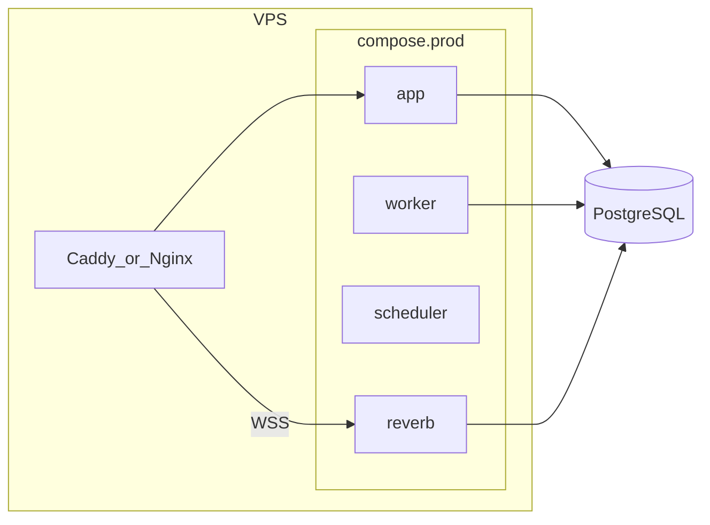

# Deployment plan

Roadmap from first production deploy through CI/CD and optional Kubernetes. For step-by-step commands on a live server, use [deployment.md](deployment.md). For local setup, see [development-workflow.md](development-workflow.md).

**Legend:** `[x]` done in repo · `[ ]` not started

---

## Executive summary

| Phase | Focus | Repo | Live infrastructure |
|-------|--------|------|---------------------|
| 0 | Code and config readiness | Done | N/A |
| 1 | Production Docker on VPS | Done (Dockerfile, compose, scripts) | **Blocked** — no VPS yet |
| 2 | Dev/prod environments, shared images | Done (compose overlays, GHCR-oriented scripts) | **Blocked** — no registry images until remote + CI |
| 3 | CI/CD | Done (workflows) | **Blocked** — no git remote; deploy secrets pending |
| 4 | Kubernetes (optional learning path) | Not started | Not started |
| 5 | Public repository decision | Not decided | N/A |
| 6 | Ongoing operations | Partially documented | N/A |

**You are here:** Phase 0 complete in git; **external prerequisites** (remote repo, VPS, DNS) not started.

---

## External prerequisites (do these before first deploy)

Nothing in this section is finished until you complete it. Repo-only work does not count as "deployed."

### 1. Choose and create a git remote

- **Recommended for this repo:** GitHub (matches [`.github/workflows/`](../.github/workflows/) and GHCR).
- Create an empty repo, add `origin`, push `main`.
- Enable GitHub Actions on the repo.
- Optional: branch protection requiring the CI **Test** job on `main`.

**Not chosen yet:** record the decision when made (`GitHub` / `GitLab` / other). If not GitHub, plan to adjust or replace workflows and registry URLs in Phase 3.

### 2. Provision hosting

- At least one VPS (or managed platform) with Docker Engine + Compose plugin.
- Optional second VPS for staging, or one VPS with staging + prod domains.
- Open ports **80** and **443**; point DNS `A`/`AAAA` at the server when you have a domain.

### 3. After remote + VPS exist

| Step | Doc |
|------|-----|
| CI green on `main` | [ci-cd.md](ci-cd.md) |
| Image on GHCR (`ghcr.io/<owner>/nerdik:<sha>`) | [ci-cd.md](ci-cd.md) |
| Server `.env`, Caddyfile, `docker login ghcr.io` | [deployment.md](deployment.md) |
| `IMAGE_TAG=<sha> make prod-deploy` (or Actions Deploy workflow) | [deployment.md](deployment.md), [ci-cd.md](ci-cd.md) |

### 4. Still local-only (fine for now)

- No VPS secrets in GitHub
- Deploy workflow will **skip** with a message until `DEPLOY_*` secrets exist
- You can develop with Sail only ([development-workflow.md](development-workflow.md))

---

## Phase 0: Code and config readiness

**Goal:** Harden the application in git before building production infrastructure.

### Code and config

- [x] Production env template: [`.env.production.example`](../.env.production.example)
- [x] Local [`.env.example`](../.env.example) points to production template (comments only)
- [x] Trust reverse proxy: `TRUSTED_PROXIES` in [`bootstrap/app.php`](../bootstrap/app.php)
- [x] Force HTTPS URLs in production when `APP_URL` is `https://` ([`AppServiceProvider`](../app/Providers/AppServiceProvider.php))
- [x] Broadcast policy documented: any **logged-in** user may subscribe to `activity.{id}` when the activity exists ([`routes/channels.php`](../routes/channels.php)) — live counters before join
- [x] Tests for broadcast channel auth ([`tests/Feature/Broadcast/ActivityParticipationChannelTest.php`](../tests/Feature/Broadcast/ActivityParticipationChannelTest.php))
- [x] `telescope:prune` scheduled only when Telescope is enabled ([`routes/console.php`](../routes/console.php))
- [x] `viewPulse` gate for admins ([`AppServiceProvider`](../app/Providers/AppServiceProvider.php))
- [x] Deploy checklist: [deployment.md](deployment.md)
- [x] Full test suite and static analysis validated (manual, pre-Phase-0)

### Already in good shape (no Phase 0 change required)

- Health endpoint `/up` ([`bootstrap/app.php`](../bootstrap/app.php))
- Security headers middleware, rate limits, strong password defaults
- Telescope registered only in `local`
- Filament admin protected (`AdminOnly`, `is_admin`)
- Large automated test suite

### Manual before first prod deploy

- [ ] Copy `.env.production.example` → server `.env` and fill secrets
- [ ] Run post-deploy steps in [deployment.md](deployment.md)

---

## Phase 1: Production Docker (VPS-friendly)

**Goal:** Run Nerdik on a VPS using Docker, without treating Sail dev compose as production.

**Current state (repo):** Production Dockerfile, `compose.stack.yaml`, and prod/dev overlays are in git.

**Current state (your servers):** Not provisioned — see [External prerequisites](#external-prerequisites-do-these-before-first-deploy).

[`compose.yaml`](../compose.yaml) is Laravel Sail for local dev (bind mounts, `artisan serve`, Adminer, Mailpit). **Do not ship it unchanged to production.**

### Tasks

- [x] Multi-stage **production Dockerfile** ([`docker/production/Dockerfile`](../docker/production/Dockerfile): composer `--no-dev`, `npm ci && npm run build`, Nginx + PHP-FPM in `app`, Caddy at edge)
- [x] **`compose.prod.yaml`** with:
  - [x] `app` (web)
  - [x] `worker` (`queue:work`)
  - [x] `scheduler` (`schedule:work`)
  - [x] `reverb`
  - [x] PostgreSQL (containerized; external managed DB documented in [deployment.md](deployment.md))
  - [x] **No** Adminer / Mailpit / Vite dev port
- [x] Persistent volumes for `storage` (and DB if containerized)
- [x] Reverse proxy (Caddy in compose) for TLS and WebSocket proxy to Reverb ([`docker/caddy/Caddyfile.example`](../docker/caddy/Caddyfile.example))
- [x] Optional: managed PostgreSQL instead of container PG (documented)

---

## Phase 2: Dev and prod environments (shared images)

**Goal:** Same Docker image for dev and prod; differ only by env and compose overlay.

### Tasks

- [x] Container registry (GHCR-ready): `ghcr.io/${GITHUB_OWNER}/nerdik:<git-sha>` immutable tags
- [x] `compose.staging.yaml` / `compose.prod.yaml` overlays on shared `compose.stack.yaml` image
- [x] Promote by deploying a SHA (`IMAGE_TAG=<git-sha> make staging-deploy|prod-deploy`)
- [x] Keep one production-grade multi-stage Dockerfile; only build args differ per environment

| Share | Do not share |
|-------|----------------|
| Image per commit | `.env` secrets |
| Compose structure | Database data |
| Migrations in repo | Sail-only services |

---

## Phase 3: CI/CD

**Goal:** Automated test, build, push, and deploy.

**Current state:** GitHub Actions in [`.github/workflows/`](../.github/workflows/). Operational guide: [ci-cd.md](ci-cd.md). Remote deploy workflows are ready; configure VPS secrets when hosting exists.

### Pipeline

- [x] On PR / push: run tests, `composer audit`, Pint (optional fail) — [`ci.yml`](../.github/workflows/ci.yml)
- [x] Build production Docker image — [`docker.yml`](../.github/workflows/docker.yml)
- [x] Push to registry on `main` or version tags — GHCR `ghcr.io/<owner>/nerdik:<sha>`
- [x] Deploy dev workflow (manual): pull image + compose + `migrate --force` — [`deploy.yml`](../.github/workflows/deploy.yml); awaits `DEPLOY_*` secrets
- [x] Deploy prod: `production` environment + manual dispatch; smoke `/up` when `PROD_APP_URL` is set

### Deploy script should

- [x] Pull image by SHA — [`scripts/deploy.sh`](../scripts/deploy.sh)
- [x] `php artisan migrate --force`
- [x] `php artisan config:cache` / `route:cache` / `view:cache`
- [x] Rolling restart worker, scheduler, Reverb

### Blocked until remote exists

- [x] Create GitHub (or other) repository and push `main`
- [ ] Verify CI and Docker workflows run on the remote
- [ ] First image tag available on GHCR (copy full SHA from Actions)

---

## Phase 4: Kubernetes (optional learning path)

**Goal:** Learn K8s using the same image from Phase 2–3. **Overkill for a first single-VPS deploy.**

### Workloads

| Workload | Role |
|----------|------|
| Deployment `web` | HTTP |
| Deployment `worker` | Queue |
| Deployment `reverb` | WebSockets |
| CronJob or Deployment | `schedule:run` |
| StatefulSet or managed | PostgreSQL |
| Ingress + cert-manager | TLS + WSS |

### Learning path

- [ ] Local cluster: **kind** or **k3d**
- [ ] Deploy same CI-built image
- [ ] Add Helm later if complexity grows

---

## Phase 5: Public repository

**Goal:** Decide whether to open-source the repo and mitigate risks.

### Generally safe

- [x] `.env`, `.env.production`, `auth.json` gitignored
- [x] OAuth/reCAPTCHA driven by env vars

### Before going public

- [x] Run secret scan on git history (`gitleaks` in CI; see `.gitleaks.toml`)
- [x] Review [`plans/`](../plans/) for internal notes you do not want public (or gitignore)
- [x] Add `SECURITY.md` and responsible disclosure — [`SECURITY.md`](../SECURITY.md), [`docs/security.md`](security.md)
- [ ] Disable or change default seeded `password` on any public staging
- [x] `composer audit` in CI

**Verdict from review:** Public repo is reasonable if secrets stay in env/CI; main risk is operational (leaked server `.env`), not PHP source alone.

---

## Phase 6: Ongoing operations and other considerations

Documented in part in [deployment.md](deployment.md); remainder for later phases.

### Operations

- [x] Backups called out (DB + `storage/app`)
- [x] Reverb required for live UX
- [ ] Monitoring / error tracking (Sentry, etc.)
- [ ] Uptime checks on `/up`
- [ ] Email deliverability (SPF/DKIM)
- [ ] Legal: privacy policy, cookies, GDPR if EU users

### Performance / scale (later)

- [ ] Reverb scaling (today: `database` queue/cache)
- [ ] CDN for static assets and public media
- [ ] Horizontal app servers only after Reverb scaling (`REVERB_SCALING_*` + Redis)

### Shortcuts (alternatives to raw VPS + Docker)

- [ ] Laravel Cloud, Forge, or Ploi if you want less ops than self-managed Docker

---

## Suggested order of work

1. **Phase 0** — done in repo  
2. **Choose git remote** — create repo, push `main`, confirm CI passes  
3. **Confirm GHCR image** — after first push to `main`, note the SHA tag from Actions → Packages  
4. **Provision VPS** — Docker, DNS, firewall  
5. **Phase 1 on server** — `.env`, Caddyfile, `IMAGE_TAG=<sha> make prod-deploy` (see [deployment.md](deployment.md))  
6. **Phase 3 secrets** — SSH deploy from Actions (optional; manual `make prod-deploy` on the server works without Actions)  
7. **Phase 2** — staging on same VPS via `compose.staging.yaml` (manual on/off)  
8. **Phase 5** — public repo when comfortable  
9. **Phase 4** — Kubernetes only if you want to learn it  
10. **Phase 6** — monitoring, backups automation, legal pages  

---

## Related docs

- [ci-cd.md](ci-cd.md) — GitHub Actions, GHCR, deploy secrets
- [deployment.md](deployment.md) — operational checklist for a deploy
- [development-workflow.md](development-workflow.md) — local Sail workflow
- [security.md](security.md) — security controls and vulnerability reporting
- [SECURITY.md](../SECURITY.md) — GitHub security policy (report a vulnerability)
- [README.md](../README.md) — project overview
