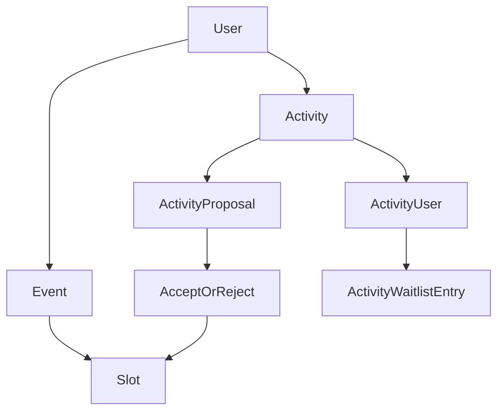

# Domain Mechanics

This document describes the app-level rules and flows behind events, activities, proposals, and participation.

## Entity Lifecycle

## Hosting Modes For Activities

Activities move through explicit hosting modes:

- `DRAFT`
- `SELF_HOSTED`
- `PROPOSED_TO_EVENT`
- `SCHEDULED_ON_EVENT`

Joinability rules depend on these modes. Participation is allowed only for joinable modes (self-hosted or scheduled on event), and cancelled activities are always blocked.

## Visibility Rules

- Public event pages are accessible by slug.
- Public activity pages require the activity to be attached to a public event (or self-hosted under the public browse constraints).
- Browse is unified under `/search`.

Key practical effect: not every existing activity row is publicly visible; visibility is constrained by hosting mode and event/slot state.

## Proposal Mechanics

## Submit

- A user proposes an activity to an event.
- Optional preferred free slots can be attached to the proposal.
- Event owner can be notified (except self-submissions where submitter is owner).

## Auto-Accept Path

When preferred slots are provided, the system can auto-accept only if there is a free non-approval slot that fits:

- activity type compatibility,
- slot duration fit,
- slot capacity fit.

If no fitting slot exists, proposal remains pending.

## Manual Accept/Reject

- Accept assigns the activity to a chosen free slot (or auto-selects a fitting free slot when no slot ID is provided).
- Reject clears accepted slot and marks proposal rejected.
- Decision triggers status updates and notifications to the proposal creator.

## Participation And Waitlist Mechanics

## Join

Join is blocked if:

- the activity is cancelled,
- hosting mode is not joinable,
- user already participates,
- user is already on waitlist,
- activity requires approval (user should join waitlist instead),
- participant limit is reached.

## Waitlist

Users can join waitlist when:

- activity requires approval, or
- activity is full.

Hosts can approve waitlist entries (for approval-required activities), subject to:

- ownership/authorization checks,
- capacity checks,
- signup validation checks.

## Host Roster Controls

Hosts can:

- mark participants absent/unmark absent,
- move participants to waitlist,
- remove participants.

Host self-removal/move protections are enforced where applicable.

## Authorization Model

- Admin users can modify any entity.
- Non-admin users can modify entities only when `created_by` matches their user ID.
- Proposal and participation decisions use these ownership checks for protected actions.

## Time, Audit, And Deletion Conventions

- Datetimes are stored in UTC.
- Profile timezone controls displayed time in UI.
- Core entities include audit columns (`created_by`, `updated_by`) populated from authenticated context.
- Soft deletes are used on key models.

Additional deletion guardrails:

- Activities scheduled on events or with roster pressure cannot be hard deleted.
- Events with scheduled activities or signup pressure are expected to be cancelled instead of hard-deleted.
